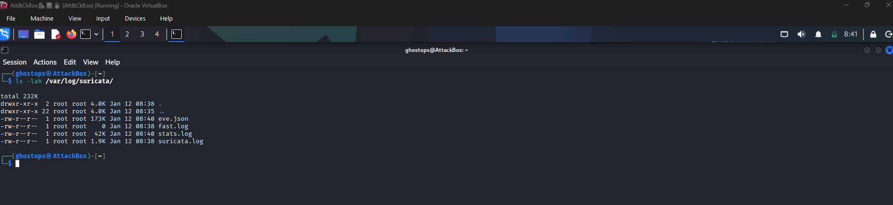
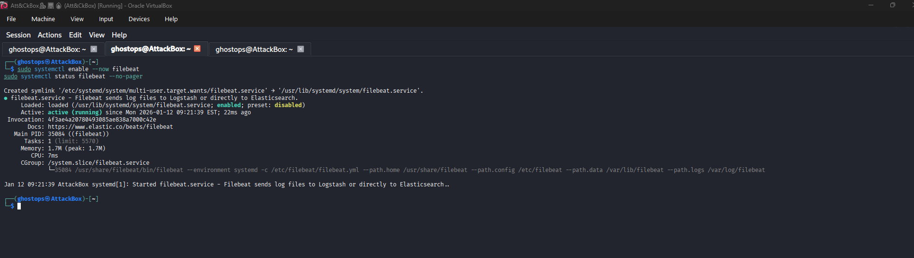
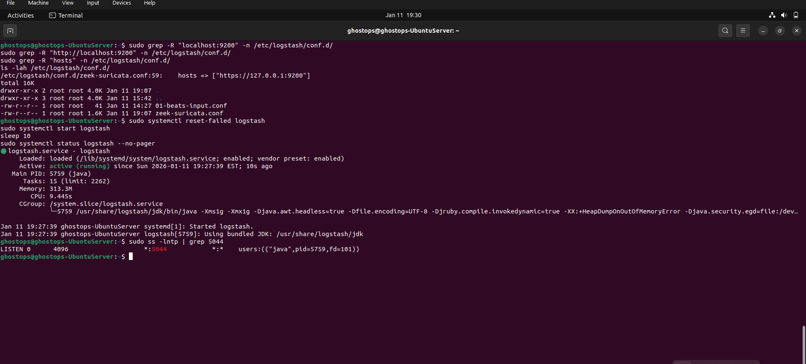
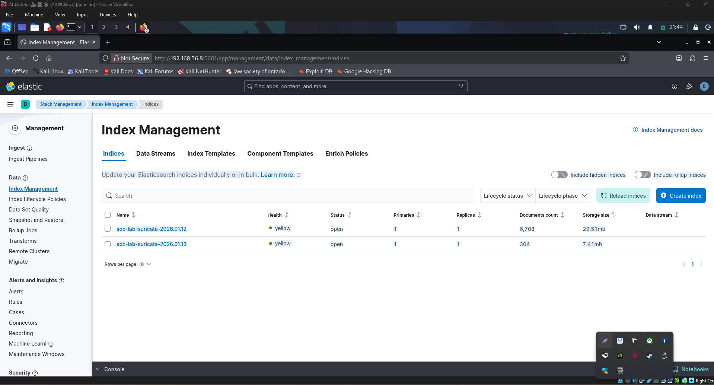

# 🛡️ SOC ELK Threat Hunting Mini-Lab  
**Suricata · Filebeat · Logstash · Elasticsearch · Kibana**

> A full end-to-end Security Operations Center (SOC) threat hunting lab demonstrating real-world network telemetry ingestion, processing, indexing, and investigation using the Elastic Stack.

---
## 👤 Author & Professional Focus

**Author:** Solomon James  
**Target Role:** SOC Analyst / Detection Engineer  

**Primary Focus:**  
- Network-based threat detection  
- Endpoint & network telemetry correlation  
- End-to-end log visibility for security operations  

**Core Skills Demonstrated:**  
- IDS telemetry analysis (Suricata)  
- Log pipeline engineering (Filebeat → Logstash → Elasticsearch)  
- Threat hunting with real network data in Kibana  
- SOC-style validation and investigation workflows  

**Frameworks & Methodologies:**  
- MITRE ATT&CK  
- Detection Engineering Lifecycle  
- Blue Team operational logging practices  

> This project is designed to mirror how modern SOC teams ingest, normalize, and hunt on real security telemetry — not simulated datasets.

---

##  Project Overview

This repository demonstrates a **production-style SOC pipeline**, not just tool installation.

It shows how **raw network traffic becomes actionable security intelligence**, following the same workflow used by modern Blue Teams:

**Suricata → Filebeat → Logstash → Elasticsearch → Kibana**

Every stage is **validated with screenshots** to prove real data flow and operational success.

---

##  Architecture Overview

 **Suricata + Filebeat** run on **Kali Linux (Sensor)**  
 **Elasticsearch, Logstash, Kibana** are hosted on **Ubuntu Server**


*Figure 1: End-to-end SOC ELK threat hunting architecture showing data flow from Suricata to Kibana.*

### 🔄 Data Flow

1. **Suricata (Kali Linux)**  
   - Inspects live network traffic  
   - Generates security events in `eve.json`  
   - Event types include:
     - `http`
     - `flow`
     - `dns`
     - `tls`

2. **Filebeat (Kali Linux)**  
   - Reads Suricata `eve.json`
   - Ships logs securely to Logstash (TCP/5044)

3. **Logstash (Ubuntu Server)**  
   - Parses and normalizes events
   - Applies SOC-style pipeline logic
   - Forwards data to Elasticsearch

4. **Elasticsearch (Ubuntu Server)**  
   - Indexes data into daily indices:
     - `soc-lab-suricata-YYYY.MM.DD`

5. **Kibana (Ubuntu Server)**  
   - Used for investigation and threat hunting
   - Events analyzed via Discover

---

##  Lab Environment

| Component | OS | Role |
|--------|----|----|
| Suricata | Kali Linux | Network IDS |
| Filebeat | Kali Linux | Log Shipper |
| Logstash | Ubuntu Server | Parsing & Enrichment |
| Elasticsearch | Ubuntu Server | Index & Search |
| Kibana | Ubuntu Server | Threat Hunting UI |

---

## Screenshot-Backed Validation

All screenshots are located in [`/screenshots`](screenshots/)  
They are numbered in execution order to reflect the SOC build-out.

---

## 🟢 Core Services Validation

| Screenshot | Description |
|---------|------------|
|  | Elasticsearch running |
|  | Kibana accessible |
|  | Logstash pipeline active |

---

## 🌐 Network & Log Ingestion

| Screenshot | Description |
|---------|------------|
|  | Suricata IDS running |
|  | Suricata generating `eve.json` |
|  | Filebeat shipping logs |
|  | Logstash listening on port 5044 |

---

## 📦 Elasticsearch Validation

| Screenshot | Description |
|---------|------------|
|  | Suricata index created |
|  | Index Management view |

---

## 🔍 Threat Hunting in Kibana (Key Evidence)


Visible SOC-critical fields:
- `@timestamp`
- `event_type`
- `src_ip`
- `dest_ip`
- `dest_port`
- `http.url`

This confirms **end-to-end visibility** from packet capture to SOC investigation.

---

##  Example Threat Hunting Query

```text
event_type: ("http" OR "flow")
